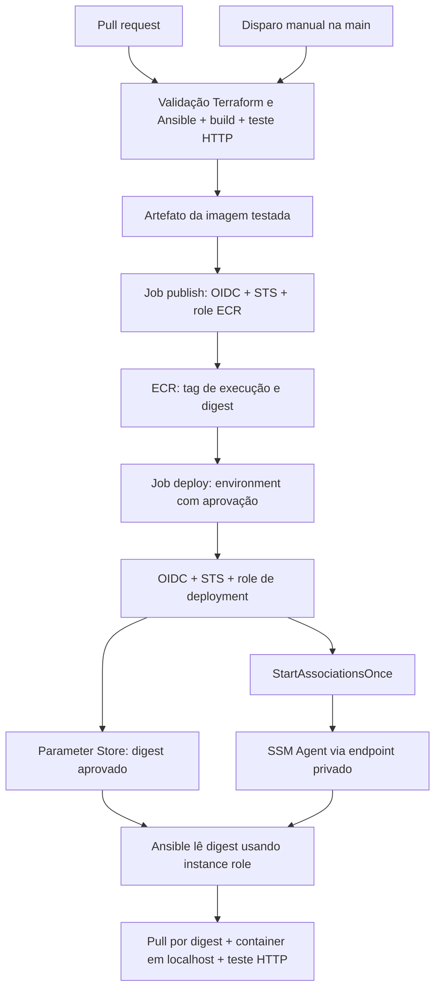

# Lab: GitHub Actions → OIDC → ECR → EC2 privada

**Lab validado ponta a ponta na AWS**, com execução manual do pipeline completo (`ci` → `publish` → `deploy`) e `deploy=true`. O workflow ativo está em `.github/workflows/container-lab.yml`; `workflow.yml.example` é apenas o modelo de referência. A seção 4 registra a validação e os problemas encontrados durante a execução.

## 1. Desenho antes da implementação

Problema: o lab anterior exige build, login e push manuais. GitHub Actions oferece um runner para executar e registrar esses passos. OIDC permite que esse runner assuma uma identidade temporária na AWS, sem guardar access keys.

Escolha arquitetural: este lab é independente e todos os arquivos ficam em `labs/compute-ec2-ecr-cicd`. Ele cria sua própria VPC, EC2, ECR, artefatos Ansible, association, parâmetro e roles. Não altera nem depende do state do lab anterior. Apenas o provider OIDC da conta é reutilizado, informado por ARN, pois ele é compartilhado por conta e não deve ser duplicado.



### Inventário e dependências

| Componente | Ação | Dependência |
| --- | --- | --- |
| VPC, EC2, 4 interface endpoints, S3 gateway | Criar neste root | Rede privada sem NAT, IGW, IP público ou SSH |
| ECR e bucket de artefatos Ansible | Criar neste root | Instance role e endpoints |
| Provider OIDC | Reutilizar por ARN | Provider já configurado na conta |
| Roles publish/deploy e suas policies | Criar neste root | Provider e ECR deste lab |
| Parâmetro SSM Standard String | Criar ao habilitar workload | Digest da primeira publicação |
| Association | Criar ao habilitar workload | EC2 pronta, artefato e parâmetro |
| Workflow/environment GitHub | Ativar manualmente depois da revisão | Variables e proteção configuradas |

Não existe dependência via remote state: o único recurso compartilhado é o provider OIDC existente. A CI não precisa de bucket/key, pois valida com `init -backend=false` e não executa plan/apply. Uma futura CI de infraestrutura deverá receber esses valores por GitHub Variables, nunca pelo código.

### IAM e segurança

| Identidade | Autorização |
| --- | --- |
| publish | Token ECR (`*`, exigência dessa API), upload de camadas, PutImage e DescribeImages apenas no repositório deste lab |
| deploy | DescribeImages no ECR, Get/PutParameter em um parâmetro, StartAssociationsOnce/DescribeAssociationExecutions em uma association |
| EC2 | SSM, pull ECR e artefatos S3 deste lab; um Deny restringe GetParameter(s) ao parâmetro escolhido |
| CI de PR | Sem `id-token: write`, sem roles AWS e sem deployment |

Authentication comprova quem é o runner: `id-token: write` permite solicitar um JWT ao GitHub; a action o apresenta ao STS com `AssumeRoleWithWebIdentity`. A trust policy verifica provider, audience `sts.amazonaws.com` e subject exato. O STS devolve credenciais temporárias. Authorization é definida pela permissions policy: quais APIs e recursos essa identidade pode usar. `id-token: write` sozinho não concede acesso AWS.

Subjects variam conforme a configuração OIDC do repositório, inclusive formatos com IDs imutáveis. Use o subject real e exato, sem wildcard. Os jobs `publish` e `deploy` usam o Environment `cloudcontent-lab`; ambos devem ter subjects desse contexto. No formato tradicional: `repo:OWNER/REPO:environment:cloudcontent-lab`; com IDs imutáveis: `repo:OWNER@OWNER_ID/REPO@REPO_ID:environment:cloudcontent-lab`. O environment muda o subject: por isso a restrição de branch **também deve existir nas deployment branch rules do environment**.

Configure `cloudcontent-lab` com apenas `main`, required reviewers e bloqueio de autoaprovação quando disponível no seu plano. Se required reviewers não estiver disponível, o disparo manual ainda é um controle operacional, mas não representa aprovação independente. Proteja a main e revise alterações em workflows, scripts e Dockerfile.

A role de deployment pode trocar o software executado na EC2, portanto é sensível mesmo sem `SendCommand`, SSH, IAM ou Terraform. Não rode escritores manuais em paralelo ao pipeline. A concurrency serializa entregas deste workflow; não bloqueia outros workflows/operadores.

### Custos e limites

Aplicar este lab cria outra EC2/EBS, quatro interface endpoints, S3 gateway, VPC, ECR e S3. Se mantiver o anterior ativo, os custos dos dois ambientes se acumulam. Também considere minutos/storage do Actions, imagens e tráfego. O parâmetro é Standard. Revise preços regionais antes do apply; os arquivos por si só não criam recursos nem custos AWS.

A lifecycle policy conserva somente as últimas 10 imagens e pode remover uma versão antiga em execução, impedindo pull/rollback. Para retenção prolongada, ajuste essa política e preserve versões de rollback. Tags de execução são únicas, mas o repositório está configurado como MUTABLE; o deployment usa o digest. `nginx:alpine` também é uma base mutável: para builds reproduzíveis, revise e fixe um digest da base. Scan-on-push continua habilitado, mas **não bloqueia** este pipeline por vulnerabilidades.

O container é substituído em uma única EC2: existe interrupção curta e não há rollback automático. Timeout/falha do job não desfaz o parâmetro; a reconciliação continuará tentando o digest desejado. Siga o rollback abaixo.

### Arquivos

- `versions.tf`, `main.tf`, `locals.tf`, `variables.tf`: versões, backend parcial e rede.
- `ec2.tf`, `security_groups.tf`, `vpc_endpoints.tf`: computação e conectividade privada.
- `ecr.tf`, `s3.tf`, `artifacts.tf`: imagens e pacote Ansible.
- `iam*.tf`, `cicd.tf`: instance role, OIDC, publicação, entrega e parâmetro.
- `ssm.tf`, `ansible/playbook.yml`, `templates/bootstrap.sh`: bootstrap e reconciliação.
- `app/`: aplicação e Dockerfile próprios deste lab.
- `workflow.yml.example`, `scripts/deploy.py`, `tests/test_deploy.py`: modelo do pipeline, entrega e testes offline.

## 2. Preparar manualmente a infraestrutura

Todos os comandos Terraform desta seção são executados **neste diretório novo**. Não execute comandos no lab anterior.

1. Obtenha o ARN do provider GitHub OIDC já configurado na conta. Se ele não existir, configure-o em seu processo de bootstrap antes deste lab.
2. Crie localmente `backend.local.tfbackend` (ignorado pelo Git) com `bucket`, uma `key` exclusiva deste lab, `profile` se necessário e `encrypt = true`. Não use a key de outro lab.
3. Crie `local.auto.tfvars` (ignorado) com os valores reais:

```hcl
oidc_provider_arn = "ARN_DO_PROVIDER_EXISTENTE"
publish_subject   = "repo:OWNER/REPO:environment:cloudcontent-lab"
deploy_subject    = "repo:OWNER/REPO:environment:cloudcontent-lab"
enable_workload   = false
```

Ajuste subjects para o formato OIDC real do repositório. Não versionar valores operacionais. Região padrão `ap-northeast-1`, CIDR `10.40.0.0/16`, nomes com sufixo `compute-ec2-ecr-cicd` e state exclusivo mantêm a infraestrutura separada.

4. Após ler os arquivos, execute por sua conta:

```sh
terraform init -backend-config=backend.local.tfbackend
terraform validate
terraform plan -out=infrastructure.tfplan
# Leia o plano completo e o custo dos recursos antes de aplicar.
terraform apply infrastructure.tfplan
terraform output
```

Nesse estágio não há association, parâmetro de imagem nem permissões de deployment na role deploy. ECR e publicação já ficam disponíveis. Verifique no Systems Manager que a EC2 está Online e, via Session Manager, que existe `/opt/cloudcontent/bootstrap-ready`. A preparação usa S3 gateway para instalar Ansible, unzip e AWS CLI; Ansible instalará Docker ao habilitar a aplicação.

5. Siga a seção 3 e rode primeiro o pipeline com `deploy=false`. Copie o digest publicado para `initial_image_digest` no `local.auto.tfvars`, e defina `enable_workload = true`:

```hcl
enable_workload     = true
initial_image_digest = "sha256:DIGEST_REAL_DE_64_HEXADECIMAIS"
```

Faça um novo plan, revise e aplique neste root. Isso cria o parâmetro com a primeira imagem, a association e as permissões de deployment. A association executa imediatamente: espere a validação HTTP terminar com sucesso. Atualize `LAB_ASSOCIATION_ID` com o output agora disponível. A partir daí o pipeline pode rodar com `deploy=true`.

O Terraform cria o parâmetro, mas `ignore_changes = [value]` entrega a propriedade do valor ao pipeline. Alterar `initial_image_digest` depois da criação não faz deployment nem rollback. A association passa o nome do parâmetro; a EC2 lê o digest a cada execução usando a instance role e o endpoint SSM. O runner não precisa entrar na VPC.

O primeiro deployment exige esse bootstrap em duas etapas, sem build/push manual. Em planos posteriores, uma AMI mais recente pode propor substituir a EC2 porque o lookup usa `most_recent`; revise essa mudança separadamente antes de aplicar.

## 3. Ativar GitHub Actions quando estiver pronto

Configure GitHub Variables (sem access keys):

| Variable | Origem |
| --- | --- |
| `AWS_ACCOUNT_ID` | Conta alvo |
| `LAB_ECR_REPOSITORY` | Output `ecr_repository_name` deste lab |
| `LAB_PUBLISH_ROLE_ARN` | Output `publish_role_arn` |
| `LAB_DEPLOY_ROLE_ARN` | Output `deploy_role_arn` |
| `LAB_PARAMETER_NAME` | Output `parameter_name` |
| `LAB_ASSOCIATION_ID` | Output `association_id` deste lab, após habilitar workload |

Configure o environment protegido conforme a seção IAM. Neste repositório, o workflow já está em `.github/workflows/container-lab.yml`. Para reproduzir o lab em outro repositório, use o modelo como ponto de partida e confira as correções do workflow ativo, incluindo `environment: cloudcontent-lab` nos jobs `publish` e `deploy`. Não sobrescreva o workflow ativo com uma cópia antiga do modelo.

Revise e faça merge na main. Este workflow só publica por `workflow_dispatch` na main; não publica automaticamente por push. PRs executam fmt/validate sem backend, syntax-check Ansible, build e teste HTTP. Os workflows antigos de foundation permanecem independentes; o workflow de plan existente pode executar em PR interno e possui OIDC próprio.

Antes da primeira execução, configure todas as Variables exceto `LAB_ASSOCIATION_ID`, que será preenchida após o passo 5 da seção 2.

Primeira execução: Actions → Container lab CI and delivery → Run workflow → main → `deploy=false`. O runner monta a imagem com Dockerfile/contexto, inicia um container e exige HTTP com `CloudContent Platform`. Salva **a mesma imagem testada** como artefato. O job publish baixa esse artefato, autentica por OIDC, obtém senha temporária ECR, faz push com tag SHA/run/attempt e exporta o digest.

Após concluir o passo 5 da seção 2: nova execução com `deploy=true`. Após CI/publicação, revise commit e digest no resumo do job publish, aprove o environment e acompanhe o deploy. Jobs não compartilham credenciais: deploy assume sua própria role após aprovação. O digest chega pelo output `needs.publish.outputs.digest`, entra no Parameter Store e `StartAssociationsOnce` solicita execução imediata. O script espera uma execução criada após a solicitação, falha em erro/timeout e não aceita um sucesso antigo. Uma reconciliação agendada nova também pode satisfazer essa espera, pois lê o mesmo parâmetro. Ansible faz pull por digest e exige saúde HTTP.

Tags são nomes que podem apontar para outra imagem; digest identifica o conteúdo do manifesto. O valor efetivamente entregue é `repository@sha256:...`, não `latest` ou a tag da execução.

## 4. Validação ponta a ponta

Execução manual do pipeline completo (`ci` → `publish` → `deploy`), com `deploy=true`, contra a AWS real. Os três jobs terminaram com sucesso na validação realizada pelo operador.

### Evidência de identidade imutável

O objetivo não foi só ver o container `Up`, e sim provar que o digest publicado pelo job `publish` é o mesmo que a EC2 privada efetivamente executa:

```text
GitHub Actions (build + testes)
 → tested-image artifact
 → GitHub OIDC → AWS STS → publish role
 → ECR (sha256:3fffd9e3...)
 → SSM Parameter Store
 → State Manager Association
 → AWS-ApplyAnsiblePlaybooks
 → Ansible → EC2 privada → Docker
 → RepoDigest sha256:3fffd9e3... ✅
```

A inspeção Docker na instância confirmou `RepoDigest` idêntico ao digest gerado pelo `publish`. Essa comparação comprova a identidade imutável do artefato do CI até o runtime. O digest abreviado identifica a evidência desta validação; cada novo release deve comparar seu próprio digest completo.

### Troubleshooting real

Três problemas apareceram durante a validação do deployment:

**1. `deploy` pulado (`skipped`) na primeira run manual.**

Hipótese: o disparo não solicitou deployment. Teste: conferir o input da execução. Resultado: o comando `gh workflow run` não passou `-f deploy=true`, então `inputs.deploy` recebeu `false`, o default do `workflow_dispatch`, e a condição `inputs.deploy && github.ref == 'refs/heads/main'` não foi satisfeita. O pipeline publicou sem fazer deployment, conforme configurado. Correção: disparar na `main` com `deploy=true`; só investigar a etapa seguinte depois de confirmar esse input.

**2. `deploy` falhando com `exit status 254`, sem mensagem legível.**

Hipótese: o script escondia o erro original da AWS CLI. Teste: inspecionar o tratamento de erro de `aws()` em `scripts/deploy.py`. Resultado: `subprocess.run(..., check=True, capture_output=True)` capturava `stderr`, mas o script não o imprimia; o traceback mostrava apenas o código de saída. Correção: conferir `returncode`, imprimir `stderr` e só então propagar a exceção com `check_returncode()`. A execução seguinte revelou a falha de autorização descrita abaixo.

**3. Causa raiz revelada: `AccessDeniedException` em `ssm:StartAssociationsOnce`.**

Hipótese: o ID usado pelo GitHub estava fora do ARN autorizado pela policy. Teste: comparar `LAB_ASSOCIATION_ID` com `terraform output -raw association_id` e com o recurso permitido pela role `cloudcontent-lab-deploy`. Resultado: a association havia sido recriada e a GitHub Variable ainda apontava para o ID antigo; a policy já autorizava o ARN da association atual (`arn:aws:ssm:...:association/<id>`).

O `terraform plan` não acusava drift porque o recurso e a policy estavam coerentes com o código. O desalinhamento estava fora do state, entre a variável do GitHub e o ID atual do recurso. Correção: usar `terraform output -raw association_id` como fonte de verdade, atualizar a Repository Variable via `gh api --method PATCH` e disparar novamente. A nova execução passou.

**Lição:** qualquer valor que atravesse a fronteira Terraform → GitHub Variables (IDs, ARNs) pode ficar desatualizado se o recurso for recriado. Hoje essa sincronização é manual; após uma recriação, confira os outputs antes de executar o pipeline.

### `terraform destroy` bloqueado por ECR não vazio

Na tentativa de limpeza, `aws_ecr_repository` ainda não tinha `force_delete`, e a remoção falhou com `RepositoryNotEmptyException`. Outros recursos já haviam sido destruídos quando o erro ocorreu: um destroy pode terminar parcialmente e não desfaz exclusões já concluídas.

Correção no código, seguindo a convenção de descarte já usada nos buckets S3 deste lab (`force_destroy = true`):

```hcl
resource "aws_ecr_repository" "app" {
  name         = "${local.name_prefix}-app"
  force_delete = true

  # Demais configurações do repositório permanecem iguais.
}
```

`force_delete = true` permite excluir o repositório mesmo com imagens. É uma escolha deliberada para este lab descartável, não um padrão a transportar para produção. A opção precisa estar aplicada ao recurso antes de depender dela na limpeza; revise o plan e o descarte das imagens.

## 5. Validação e rollback

Critérios para considerar concluído:

1. PR: CI passa sem credenciais AWS; publish e deploy ficam skipped.
2. Disparo fora da main: publicação e deployment ficam skipped.
3. `deploy=false`: imagem publicada, parâmetro inalterado.
4. `deploy=true`: aprovação exigida, execução nova da association termina em Success.
5. Via Session Manager, compare `docker inspect cloudcontent-app --format '{{.Config.Image}}'` com o digest publicado e faça `curl -f http://127.0.0.1:8080`.
6. Confira que nova execução periódica mantém a imagem e que plan posterior não tenta restaurar o digest inicial.

Rollback é uma **nova entrega controlada**. Pare outras entregas, obtenha o digest anterior no log e confirme que ainda existe no ECR. Depois da revisão/aprovação operacional, com uma identidade autorizada e AWS CLI v2:

```sh
# Configure estas variáveis localmente, sem versionar valores operacionais.
export AWS_DEFAULT_REGION=ap-northeast-1
export ECR_REPOSITORY='NOME_DO_REPOSITORIO'
export ASSOCIATION_ID='ID_DA_ASSOCIATION'
export PARAMETER_NAME='/cloudcontent/compute-ec2-ecr-cicd/image-digest'
export IMAGE_DIGEST='sha256:DIGEST_ANTERIOR'
python3 labs/compute-ec2-ecr-cicd/scripts/deploy.py
```

Não recrie a imagem com uma tag antiga esperando o mesmo digest. Repita a validação por SSM após o rollback. Para desativar o lab, desative/remova seu workflow e faça `terraform plan -destroy` neste root. Leia o plano antes de `terraform destroy`. O ECR está configurado com `force_delete = true`: com essa configuração aplicada, a remoção também descarta suas imagens. Confirme esse descarte antes de destruir o lab. O bucket Ansible tem `force_destroy = true`, portanto seus artefatos e versões serão removidos no destroy. O provider OIDC compartilhado não é gerenciado por este root. O lab anterior permanece independente.

## 6. Troubleshooting: uma hipótese por vez

| Hipótese | Um teste | Resultado → próxima hipótese |
| --- | --- | --- |
| Workflow ainda é modelo | Confira se existe em `.github/workflows` na main | Ausente: ativar quando pronto; presente: conferir evento/branch |
| JWT não é solicitado | Confira `id-token: write` no job com erro | Ausente: corrigir; presente: conferir trust |
| Subject/audience não correspondem | Compare claims `sub`/`aud` com trust via ferramenta de diagnóstico controlada, sem imprimir JWT completo | Diferentes: corrigir subject exato; iguais: conferir provider/conta |
| Push não autorizado | Confira ação e ARN negados no erro ECR | ARN errado: corrigir variável/policy; certo: conferir autenticação temporária |
| Deployment não foi liberado | Confira o job aguardando environment | Aguardando: revisar/aprovar; liberado: conferir role deploy |
| Parâmetro não encontrado | Leia o nome configurado em ExtraVariables da association | Divergente: corrigir configuração; igual: conferir existência/IAM |
| EC2 não recebe trabalho | Confira managed node Online no Systems Manager | Offline: diagnosticar agent/endpoints; Online: abrir execução nova da association |
| Pull falha | Leia a falha da tarefa de pull no resultado SSM | Digest ausente: retenção/ECR; AccessDenied: instance policy; timeout: endpoints/DNS |
| HTTP falha após pull | Via SSM, execute `docker logs cloudcontent-app` | Erro de processo: corrigir imagem; processo normal: conferir binding/HTTP |
| Job expira | Consulte histórico da association e horário da execução | Sem execução nova: trigger/agent; execução Failed: primeira tarefa com erro; Success posterior: validar digest e saúde antes de repetir |

Registre hipótese, teste, resultado e só então avance. Não amplie IAM para `*` como tentativa genérica de correção.

## Referências oficiais

- [GitHub: OIDC com AWS e proteção de environments](https://docs.github.com/en/actions/how-tos/secure-your-work/security-harden-deployments/oidc-in-aws).
- [GitHub: referência de claims OIDC](https://docs.github.com/en/actions/reference/security/oidc).
- [AWS: iniciar uma association](https://docs.aws.amazon.com/systems-manager/latest/APIReference/API_StartAssociationsOnce.html).
- [AWS: ações e recursos IAM do SSM](https://docs.aws.amazon.com/service-authorization/latest/reference/list_ssm.html).
