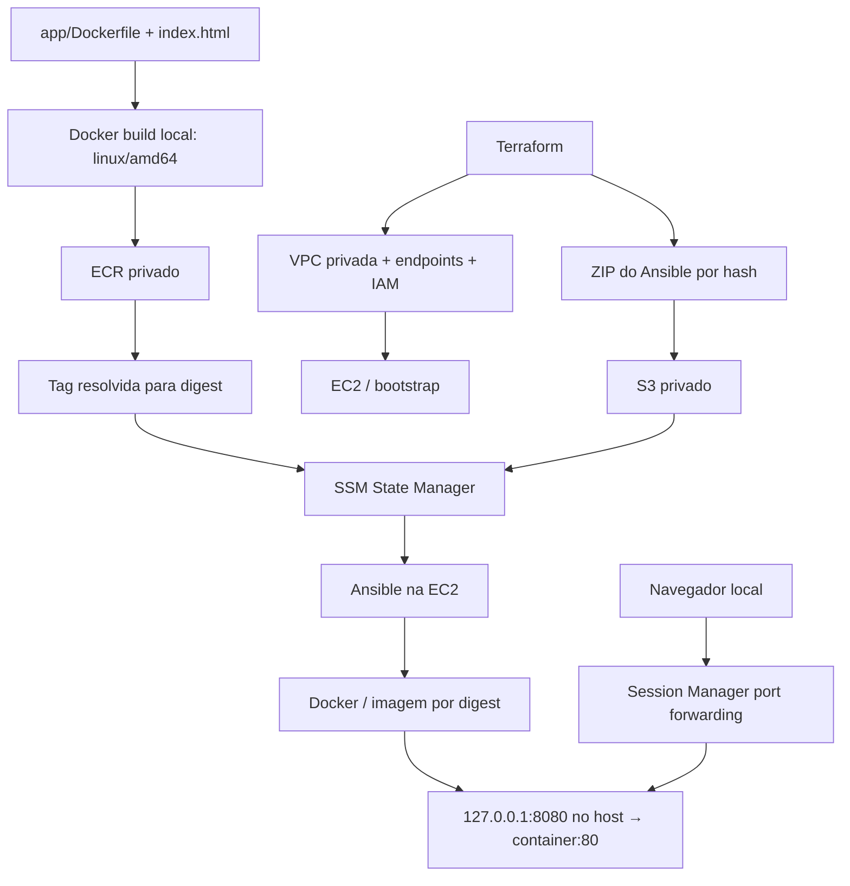

# Runbook — EC2 privada + Ansible + Docker + ECR

Este lab constrói uma plataforma pequena: Terraform cria uma EC2 privada e seus
serviços de apoio; uma imagem Nginx é construída localmente e publicada no ECR;
o SSM State Manager executa Ansible na EC2 para instalar Docker, puxar a imagem
e manter a aplicação disponível. O acesso HTTP ocorre por túnel do Session Manager.

O root Terraform é **`labs/compute-ec2-ecr`**, com state independente. Os outros
labs serviram de referência; este lab cria sua própria rede, instância e endpoints.
Não depende de recursos de `compute-ec2-ssm` ou `ansible-ec2-ssm`, além do bucket
compartilhado de backend já existente. Região padrão: `ap-northeast-1`.

## 1. Inventário e função de cada componente

| Componente | Função |
| --- | --- |
| VPC `10.30.0.0/16` e subnet `10.30.10.0/24` | Rede isolada em uma AZ, com DNS habilitado |
| EC2 `t3.micro`, Amazon Linux 2023 x86_64 | Host do Docker; EBS de 16 GiB criptografado; IMDSv2 obrigatório |
| Security group da EC2 | Sem ingress; HTTPS de saída somente para endpoints e prefix list do S3 |
| Endpoints `ssm` e `ssmmessages` | Registro, comandos e sessões do Systems Manager |
| Endpoints `ecr.api` e `ecr.dkr` | Autenticação/API e protocolo de registry do ECR |
| S3 Gateway Endpoint | Artefato Ansible, repositórios regionais do AL2023 e layers das imagens ECR |
| IAM instance profile | Credenciais temporárias para SSM, leitura do artefato e pull do repository |
| ECR privado | Imagem da aplicação, tags mutáveis e scanning no push |
| ECR lifecycle policy | Expiração assíncrona das imagens mais antigas além das dez mais recentes |
| Bucket de artefatos S3 | ZIP do playbook, versionamento, SSE-S3 e bloqueio de acesso público |
| SSM State Manager | Executa `AWS-ApplyAnsiblePlaybooks` imediatamente e a cada 30 minutos |
| Ansible | Instala/inicia Docker, faz login/pull, reconcilia o container e testa HTTP |
| Aplicação Nginx | Página mínima com o texto `CloudContent Platform` |
| Session Manager | Terminal e port forwarding sem SSH, bastion ou portas públicas |

Não há NAT Gateway, Internet Gateway, IP público, chave SSH ou access key estática
na EC2. A máquina local precisa de acesso à internet para baixar ferramentas,
imagem base e conversar com as APIs AWS. Os quatro endpoints de interface,
EC2, EBS, S3 e ECR geram cobrança enquanto existirem.

## 2. Fluxo e dependências



O primeiro apply cria a infraestrutura com `enable_workload = false`. Depois do
push, o segundo apply consulta a tag no ECR e passa um **digest** ao Ansible. Assim,
um push posterior na mesma tag não muda silenciosamente o container: execute um
novo plan/apply para atualizar o digest desejado. Se a tag não existir, a consulta
falha antes da criação da associação. O documento AWS rejeita `:` nas extra-vars;
o Terraform passa `image_sha256` com os 64 caracteres do hash e o playbook
reconstrói o prefixo `sha256:` na referência Docker.

O Terraform aguarda os endpoints, regras de rede e attachments IAM antes de
iniciar a EC2. O `user_data` instala os pré-requisitos do Ansible e grava
`/opt/cloudcontent/bootstrap-ready`. A prontidão do sistema operacional é uma
verificação separada: criar a EC2 não significa que o bootstrap terminou.

O ZIP usa uma key com hash do conteúdo. Alterar o playbook altera o objeto e a URL
passada à associação, provocando uma nova execução. `depends_on` ordena upload e
permissões; ele não substitui a verificação de bootstrap descrita no deploy.

## 3. Código explicado, arquivo por arquivo

| Arquivo | O que faz e por quê |
| --- | --- |
| `versions.tf` | Terraform `~> 1.15.0`, AWS `~> 6.0`, Archive `~> 2.7` e backend S3 parcial com lockfile nativo |
| `.terraform.lock.hcl` | Versões e checksums dos providers; `awscc` é uma dependência do módulo VPC |
| `variables.tf` | Região, projeto, CIDRs, `enable_workload` e `image_tag`; a tag é validada antes de chegar ao SSM |
| `locals.tf` | Prefixo `cloudcontent-compute-ec2-ecr`, tags, IDs das subnets/route tables e mapa dos quatro endpoints |
| `main.tf` | Reutiliza `aws-ia/vpc/aws` 4.9.0; uma subnet de aplicação, sem conexão com NAT |
| `data.tf` | Obtém conta e partition em runtime; dados da conta não são hardcoded |
| `ec2.tf` | Seleciona a AMI AL2023 x86_64 mais recente, configura instance profile, disco, IMDSv2 e bootstrap |
| `templates/bootstrap.sh` | Instala `ansible-core`, `unzip` e `awscli-2`, com tentativas limitadas; mantém o SSM Agent habilitado |
| `security_groups.tf` | EC2 sai em TCP/443 para o SG dos endpoints e prefix list S3; endpoints aceitam TCP/443 do SG da EC2 |
| `vpc_endpoints.tf` | S3 nas route tables privadas; interfaces SSM/ECR com private DNS |
| `iam.tf` | Trust policy EC2, role, instance profile e `AmazonSSMManagedInstanceCore` |
| `iam_ecr.tf` | `GetAuthorizationToken` em `*`; três ações de pull limitadas ao ARN do repository deste lab |
| `iam_ansible.tf` | Localização do bucket, listagem com prefixo `ansible/*` e leitura de objetos nesse prefixo |
| `s3.tf` | Bucket de artefatos privado e versionado, ownership enforced e criptografia SSE-S3 |
| `artifacts.tf` | Cria o ZIP em `.generated/` e publica em S3; elimina empacotamento/upload manual |
| `ecr.tf` | Repository com scanning no push, tags `MUTABLE` e lifecycle de dez imagens |
| `ssm.tf` | Consulta o digest da tag e cria a associação condicional; passa região, repository e digest como extra-vars |
| `outputs.tf` | IDs, URL do ECR, bucket/key, associação e imagem desejada para os comandos operacionais |
| `ansible/playbook.yml` | Configura o runtime, reconcilia o container e exige HTTP 200 com o texto da aplicação |
| `app/Dockerfile` e `app/index.html` | Copiam a página estática para a imagem Nginx |
| `.gitignore` | Ignora o ZIP gerado; o ignore da raiz já cobre backend local, tfvars, cache, states e planos |

### Terraform: como os blocos se conectam

`local.name_prefix` combina o projeto em minúsculas com o nome do lab.
`merge(local.common_tags, { Name = ... })` adiciona um nome específico sem perder
as tags comuns. A tag `Lab` identifica estes recursos, mas o SSM usa o ID exato da
EC2 como target para não alcançar outras instâncias por engano.

O módulo VPC devolve subnets e route tables em mapas. `values(...)` obtém os IDs
das subnets de papel `app`; a compreensão de listas seleciona somente as route
tables privadas cuja chave começa com `app/`. Esses IDs ligam EC2, interfaces e
S3 Gateway à mesma rede. A AZ usa `${var.aws_region}a`; o lab assume uma AZ com
esse nome disponível na região escolhida.

`for_each = local.interface_endpoint_services` transforma quatro entradas do mapa
em quatro endpoints. `private_dns_enabled = true` faz os nomes usuais de SSM/ECR
resolverem para as interfaces privadas. O SG dos endpoints recebe HTTPS do SG da
EC2, e o SG da EC2 permite a saída correspondente. O S3 usa outra mecânica: uma
rota para a prefix list regional, criada pelo gateway nas route tables da subnet.
As layers ECR são baixadas desse caminho S3, não somente de `ecr.dkr`.

Na IAM, a trust policy permite que o serviço EC2 assuma a role; o instance profile
anexa essa role à instância. `ecr:GetAuthorizationToken` precisa de `resources =
["*"]` porque não aceita escopo por repository. `BatchGetImage`,
`GetDownloadUrlForLayer` e `BatchCheckLayerAvailability` ficam restritos ao
repository deste lab. A condição `s3:prefix` se aplica à listagem; a localização
do bucket fica em um statement separado e a leitura usa o ARN `ansible/*`.

`jsonencode` transforma estruturas HCL em JSON para IAM, lifecycle e `SourceInfo`.
O `archive_file` gera um ZIP com `playbook.yml` na raiz. O hash na key S3 faz uma
mudança de conteúdo alterar a entrada da associação. `count = enable_workload ?
1 : 0` controla tanto a consulta da imagem quanto a associação; `try(..., null)`
nos outputs permite consultar a infraestrutura antes de habilitar o workload.

### Ansible: comportamento em cada execução

1. Confere os parâmetros e o marcador de bootstrap.
2. Garante que Docker está instalado e que o serviço está habilitado/iniciado.
3. Autentica no ECR usando a role da EC2. O token fica em diretório temporário;
   o bloco `always` remove esse diretório inclusive se o pull falhar; `no_log`
   protege a tarefa de login.
4. Faz pull de `repository@sha256:...`, inspeciona imagem e container.
5. Recria o container somente se imagem, referência, porta ou restart policy
   divergirem. Se o container correto estiver parado, apenas o inicia.
6. Publica **`127.0.0.1:8080:80`** com `unless-stopped`. A aplicação fica acessível
   no loopback da EC2 e pelo túnel SSM, sem regra de ingress.
7. Testa HTTP 200 e conteúdo. Uma execução bem-sucedida comprova também que o
   workload respondeu no host; o teste do túnel verifica a experiência local.

A reconciliação periódica reinicia um container parado manualmente. Para
manutenção, desabilite a associação de forma planejada. A lifecycle do ECR pode
expirar até uma imagem em uso se ela estiver entre as mais antigas; dez imagens
é uma política de lab, não uma política de retenção de releases de produção.
A AMI usa `most_recent` e `nginx:alpine` é uma referência móvel: novos planos/builds
podem selecionar versões novas. Confira o diff e o digest a cada atualização.

## 4. Deploy do início ao fim

Execute os comandos a partir da raiz do repositório, em Bash. Os dois applies são
intencionais: a imagem precisa existir antes de habilitar a associação.

### 4.1. Pré-requisitos e autenticação

Instale Terraform 1.15.x, AWS CLI v2, Docker com acesso ao daemon e o plugin do
Session Manager. Use um profile AWS SSO/Identity Center já configurado:

```bash
export AWS_PROFILE='<seu-profile-local>'
export AWS_REGION='ap-northeast-1'
export AWS_DEFAULT_REGION="$AWS_REGION"
export LAB='labs/compute-ec2-ecr'

aws sso login --profile "$AWS_PROFILE"
aws sts get-caller-identity
terraform version
docker info
session-manager-plugin --version
```

O operador precisa provisionar EC2/VPC, endpoints, IAM (incluindo PassRole), S3,
ECR e associações SSM; publicar imagens; ler o backend; usar Run Command e Session
Manager. Essas permissões pertencem ao operador, não à role de pull da EC2.

### 4.2. Backend privado

`backend.local.tfbackend` já foi criado localmente com bucket/profile existentes e
uma **key exclusiva deste lab**, e deve continuar ignorado pelo Git. Não copie a
key de outro lab. Em outro checkout, preencha o arquivo com valores do ambiente:

```hcl
bucket  = "<BUCKET_DE_STATE_EXISTENTE>"
key     = "<KEY_EXCLUSIVA_COMPUTE_EC2_ECR>"
profile = "<PROFILE_LOCAL>"
encrypt = true
```

O backend versionado contém apenas região e locking; ele não cria o bucket de
state. O `profile` do backend autentica o state; `AWS_PROFILE` autentica o provider.
Use a mesma conta pretendida nos dois. Não coloque credenciais no arquivo.

```bash
chmod 600 "$LAB/backend.local.tfbackend"
git check-ignore "$LAB/backend.local.tfbackend"
terraform -chdir="$LAB" init -backend-config=backend.local.tfbackend
terraform -chdir="$LAB" fmt -check -recursive
terraform -chdir="$LAB" validate
```

### 4.3. Criar a infraestrutura

Em um lab novo, `enable_workload` é `false` por padrão:

```bash
terraform -chdir="$LAB" plan -out=infrastructure.tfplan
terraform -chdir="$LAB" show infrastructure.tfplan
terraform -chdir="$LAB" apply infrastructure.tfplan

INSTANCE_ID=$(terraform -chdir="$LAB" output -raw instance_id)
ECR_REPOSITORY=$(terraform -chdir="$LAB" output -raw ecr_repository_url)
ECR_NAME=$(terraform -chdir="$LAB" output -raw ecr_repository_name)
ECR_REGISTRY=${ECR_REPOSITORY%%/*}
```

Revise as criações: este é um root independente e cria toda a rede/EC2, não apenas
os dois recursos ECR. Não devem aparecer NAT, Internet Gateway, IP público ou
mudanças em recursos de outros states. Reexecuções podem propor zero mudanças.

### 4.4. Aguardar SSM e bootstrap

```bash
aws ssm describe-instance-information \
  --filters "Key=InstanceIds,Values=$INSTANCE_ID" \
  --query 'InstanceInformationList[].{Instance:InstanceId,Status:PingStatus}'
```

Aguarde `Online`. Execute a verificação remota abaixo; ela não usa SSH:

```bash
BOOTSTRAP_COMMAND=$(aws ssm send-command \
  --instance-ids "$INSTANCE_ID" \
  --document-name AWS-RunShellScript \
  --parameters '{"commands":["cloud-init status --wait","test -f /opt/cloudcontent/bootstrap-ready && ansible-playbook --version && aws --version"],"executionTimeout":["600"]}' \
  --query 'Command.CommandId' --output text)

aws ssm wait command-executed \
  --command-id "$BOOTSTRAP_COMMAND" --instance-id "$INSTANCE_ID"
aws ssm get-command-invocation \
  --command-id "$BOOTSTRAP_COMMAND" --instance-id "$INSTANCE_ID" \
  --query '{Status:Status,Stdout:StandardOutputContent,Stderr:StandardErrorContent}'
```

O waiter da CLI pode terminar antes de um bootstrap demorado. Consulte novamente
o comando até `Success`; não habilite o workload se faltarem os pré-requisitos.
Em falha, examine `/var/log/cloud-init-output.log` por Session Manager.

### 4.5. Construir e testar a imagem local

A EC2 é x86_64. Force a plataforma inclusive em computadores ARM:

```bash
docker build --platform linux/amd64 -t cloudcontent-app:lab "$LAB/app"
docker run --detach --rm --name cloudcontent-ecr-local-test \
  --publish 127.0.0.1:18080:80 cloudcontent-app:lab
curl --fail --retry 10 --retry-all-errors --retry-delay 1 http://127.0.0.1:18080
docker stop cloudcontent-ecr-local-test
```

Esperado: HTTP 200 e `CloudContent Platform`. Em ARM, o teste local da imagem
amd64 exige suporte de emulação do Docker; o alvo EC2 continua sendo amd64.

### 4.6. Publicar no ECR

```bash
set -o pipefail
aws ecr get-login-password --region "$AWS_REGION" |
  docker login --username AWS --password-stdin "$ECR_REGISTRY"
docker tag cloudcontent-app:lab "${ECR_REPOSITORY}:lab"
docker push "${ECR_REPOSITORY}:lab"
docker logout "$ECR_REGISTRY"

aws ecr describe-images --repository-name "$ECR_NAME" \
  --image-ids imageTag=lab \
  --query 'imageDetails[].{Digest:imageDigest,Tags:imageTags,Bytes:imageSizeInBytes}'
```

O login recebe um token temporário. O build/push acontece na máquina local; a EC2
não acessa Docker Hub e não recebe permissão de push.

### 4.7. Habilitar Ansible e o workload

Persista a escolha no arquivo local ignorado, para um próximo plan não remover a
associação por voltar ao default `false`. Se o arquivo já existir, edite os campos
em vez de sobrescrever outras personalizações:

```bash
cat > "$LAB/local.auto.tfvars" <<'VARS'
enable_workload = true
image_tag       = "lab"
VARS

terraform -chdir="$LAB" plan -out=workload.tfplan
terraform -chdir="$LAB" show workload.tfplan
terraform -chdir="$LAB" apply workload.tfplan

ASSOCIATION_ID=$(terraform -chdir="$LAB" output -raw association_id)
terraform -chdir="$LAB" output -raw deployed_image
```

O apply espera até 15 minutos pelo sucesso da associação. Timeout não remove os
recursos criados: consulte a execução, corrija a causa e reexecute. Em atualizações,
confirme a execução mais recente, pois um status antigo de sucesso não prova que
o último deploy terminou.

### 4.8. Publicar uma alteração

Edite `app/index.html`, construa e publique uma nova tag, por exemplo `lab-v2`.
Altere `image_tag` no arquivo local e execute plan/apply. O digest novo atualiza a
associação e o Ansible substitui o container. Para alterar somente o playbook,
edite `ansible/playbook.yml` e execute plan/apply: o ZIP e o upload são automáticos.
Sempre mantenha o plano salvo e o código correspondente até concluir o apply.

## 5. Diagnóstico e operação

Siga **associação → execução → target → Run Command → stdout/stderr**:

```bash
aws ssm describe-association-executions --association-id "$ASSOCIATION_ID" \
  --query 'AssociationExecutions[].{Id:ExecutionId,Status:Status,Created:CreatedTime}'

EXECUTION_ID=$(aws ssm describe-association-executions \
  --association-id "$ASSOCIATION_ID" \
  --query 'sort_by(AssociationExecutions,&CreatedTime)[-1].ExecutionId' --output text)

aws ssm describe-association-execution-targets \
  --association-id "$ASSOCIATION_ID" --execution-id "$EXECUTION_ID"

COMMAND_ID=$(aws ssm describe-association-execution-targets \
  --association-id "$ASSOCIATION_ID" --execution-id "$EXECUTION_ID" \
  --query 'AssociationExecutionTargets[0].OutputSource.OutputSourceId' --output text)

aws ssm list-command-invocations --command-id "$COMMAND_ID" --details
```

A saída retornada pelas APIs pode ser truncada (`list-command-invocations` retorna
um trecho ainda menor que `get-command-invocation`). Para obter o recap completo,
abra uma sessão SSM na EC2 e examine os arquivos `stdout` em
`/var/lib/amazon/ssm/<INSTANCE_ID>/document/orchestration/<COMMAND_ID>/`.
O ID do comando vem de `OutputSourceId`; ele não é o ID da execução da associação.

| Sintoma | Verificação |
| --- | --- |
| EC2 não aparece `Online` | Role SSM, endpoints `ssm`/`ssmmessages`, DNS e HTTPS entre SGs; estado do agent |
| `ansible-playbook`/`unzip` ausente | Bootstrap, `cloud-init-output.log`, rota S3 e instalação via DNF |
| Falha de download do ZIP | Key/URL em `SourceInfo`, objeto S3 e policy `ansible/*`; não restringir GetBucketLocation por prefixo |
| `ImageNotFoundException` no plan | Publicar a tag em `image_tag` no repository/região corretos |
| Erro de login/pull ECR | Instance role, endpoint API, endpoint DKR e endpoint S3 para as layers |
| `exec format error` | Imagem construída para arquitetura diferente de `linux/amd64` |
| HTTP não responde | `docker ps -a`, `docker logs`, binding de porta e estado do serviço Docker |
| Túnel falha | Plugin local, permissão StartSession, SSM Online e porta local disponível |
| Destroy do ECR falha | Repository não vazio; remover imagens de forma explícita antes do destroy |

O endpoint S3 usa a policy padrão. Não a limite apenas ao bucket do playbook: os
repositórios do AL2023 e o bucket regional de layers ECR também precisam passar
por ele. IAM continua limitando a leitura do artefato privado e o pull do ECR.

### Limpeza

Ao terminar, revise o plano de destruição deste root. O bucket de artefatos tem
`force_destroy = true`: seu conteúdo e versões serão removidos junto com o lab.
O repository ECR não permite remoção forçada; liste e exclua explicitamente as
imagens deste repository pela CLI/console antes de aplicar o destroy. O bucket de
backend é externo ao root e não é destruído por ele.

```bash
terraform -chdir="$LAB" plan -destroy -out=destroy.tfplan
terraform -chdir="$LAB" show destroy.tfplan
# Execute somente após revisar e esvaziar o repository deste lab:
terraform -chdir="$LAB" apply destroy.tfplan
```

Referências: [endpoints privados do ECR](https://docs.aws.amazon.com/AmazonECR/latest/userguide/vpc-endpoints.html),
[Ansible pelo State Manager](https://docs.aws.amazon.com/systems-manager/latest/userguide/systems-manager-state-manager-ansible.html),
[repositórios do AL2023](https://docs.aws.amazon.com/linux/al2023/ug/managing-repos-os-updates.html).

## 6. Validação final — passo a passo

Use este roteiro depois dos dois applies. Os resultados esperados abaixo são
critérios de aceite; consulte `VALIDATION.md` para o que foi efetivamente executado.

### 6.1. Recuperar o contexto

Com o profile autenticado e `LAB`/região definidos conforme a seção 4:

```bash
INSTANCE_ID=$(terraform -chdir="$LAB" output -raw instance_id)
VPC_ID=$(terraform -chdir="$LAB" output -raw vpc_id)
APP_SG=$(terraform -chdir="$LAB" output -raw app_security_group_id)
ECR_NAME=$(terraform -chdir="$LAB" output -raw ecr_repository_name)
ASSOCIATION_ID=$(terraform -chdir="$LAB" output -raw association_id)
```

### 6.2. Provar que a infraestrutura é privada

```bash
aws ec2 describe-instances --instance-ids "$INSTANCE_ID" \
  --query 'Reservations[].Instances[].{State:State.Name,PrivateIP:PrivateIpAddress,PublicIP:PublicIpAddress,IMDS:MetadataOptions.HttpTokens}'
aws ec2 describe-security-groups --group-ids "$APP_SG" \
  --query 'SecurityGroups[].{Ingress:IpPermissions,Egress:IpPermissionsEgress}'
aws ec2 describe-route-tables --filters "Name=vpc-id,Values=$VPC_ID" \
  --query 'RouteTables[].Routes'
aws ec2 describe-nat-gateways --filter "Name=vpc-id,Values=$VPC_ID" \
  --query 'NatGateways[?State!=`deleted`].NatGatewayId'
aws ec2 describe-internet-gateways --filters "Name=attachment.vpc-id,Values=$VPC_ID" \
  --query 'InternetGateways[].InternetGatewayId'
aws ec2 describe-vpc-endpoints --filters "Name=vpc-id,Values=$VPC_ID" \
  --query 'VpcEndpoints[].{Service:ServiceName,Type:VpcEndpointType,State:State,PrivateDNS:PrivateDnsEnabled}'
```

Esperado: instância `running`, PublicIP `null`, IMDS `required`, ingress `[]`, nenhum
NAT/IGW, nenhuma rota default para internet. Cinco endpoints `available`: quatro
interfaces com private DNS e um gateway S3. O gateway não precisa de private DNS.

### 6.3. Conferir ECR, artefato e associação

```bash
aws ecr describe-repositories --repository-names "$ECR_NAME" \
  --query 'repositories[].{Mutability:imageTagMutability,Scanning:imageScanningConfiguration}'
aws ecr get-lifecycle-policy --repository-name "$ECR_NAME" --query lifecyclePolicyText
aws ecr describe-images --repository-name "$ECR_NAME" --image-ids imageTag=lab

ARTIFACT_BUCKET=$(terraform -chdir="$LAB" output -raw ansible_artifacts_bucket)
ARTIFACT_KEY=$(terraform -chdir="$LAB" output -raw ansible_artifact_key)
aws s3api head-object --bucket "$ARTIFACT_BUCKET" --key "$ARTIFACT_KEY" \
  --query '{Bytes:ContentLength,Encryption:ServerSideEncryption,Version:VersionId}'

aws ssm describe-association-executions --association-id "$ASSOCIATION_ID" \
  --query 'sort_by(AssociationExecutions,&CreatedTime)[-1].{Id:ExecutionId,Status:Status,Created:CreatedTime}'
```

Esperado: tag publicada, digest existente, scanning habilitado, policy com
`countNumber = 10`, ZIP não vazio com AES256/version ID e última execução `Success`.
Se você escolheu outra tag, ajuste `imageTag=lab`. Scanning habilitado não significa
zero vulnerabilidades; consulte os findings separadamente quando disponíveis.

### 6.4. Conferir runtime, imagem e HTTP dentro da EC2

```bash
aws ssm start-session --target "$INSTANCE_ID"
```

Dentro da sessão:

```bash
sudo cloud-init status --long
sudo test -f /opt/cloudcontent/bootstrap-ready
ansible-playbook --version
docker --version
sudo systemctl is-active docker
sudo systemctl is-enabled docker
sudo docker ps --filter name=cloudcontent-app
sudo docker inspect cloudcontent-app \
  --format '{{.Config.Image}} {{.HostConfig.RestartPolicy.Name}} {{json .HostConfig.PortBindings}}'
sudo docker logs --tail 30 cloudcontent-app
curl --fail http://127.0.0.1:8080
```

Esperado: bootstrap completo, Docker `active`/`enabled`, container `Up`, referência
por digest igual ao output `deployed_image`, policy `unless-stopped`, binding
`127.0.0.1:8080` e página com `CloudContent Platform`. Saia com `exit`.

### 6.5. Testar no navegador local sem expor porta pública

```bash
aws ssm start-session --target "$INSTANCE_ID" \
  --document-name AWS-StartPortForwardingSession \
  --parameters '{"portNumber":["8080"],"localPortNumber":["18080"]}'
```

Mantenha esse terminal aberto. Em outro terminal:

```bash
curl --fail http://127.0.0.1:18080
```

Abra também `http://127.0.0.1:18080` no navegador. Esperado: a mesma página. A porta
local 18080 evita conflito com serviços locais usando 8080. Encerre o túnel com Ctrl+C.

### 6.6. Provar idempotência

Na EC2, anote `sudo docker inspect --format '{{.Id}}' cloudcontent-app`.
No terminal local, solicite outra execução e acompanhe seu novo ExecutionId:

```bash
aws ssm start-associations-once --association-ids "$ASSOCIATION_ID"
aws ssm describe-association-executions --association-id "$ASSOCIATION_ID"
```

Após a nova execução terminar em `Success`, repita o inspect na EC2. Sem mudança de
imagem/configuração, o ID deve ser o mesmo e o recap do playbook deve indicar
`changed=0`. Use o roteiro de diagnóstico para consultar o stdout dessa execução.

### 6.7. Testar restart e reboot

Dentro da EC2:

```bash
sudo docker restart cloudcontent-app
curl --fail --retry 10 --retry-all-errors --retry-delay 1 http://127.0.0.1:8080
sudo reboot
```

O retry do `curl` cobre também resets de conexão durante a inicialização do Nginx.
A sessão será interrompida. Aguarde EC2 e SSM voltarem a `running`/`Online`, abra
nova sessão e repita `systemctl is-active docker`, `docker ps` e `curl`. Esperado:
Docker e container retornam automaticamente. Teste antes da próxima execução
periódica do Ansible para verificar a recuperação pelo Docker. Reabra o túnel se
quiser repetir o acesso no navegador. Não pare manualmente o container antes do
reboot: `unless-stopped` respeita esse estado até o Ansible reconciliar novamente.

### 6.8. Confirmar convergência do Terraform e higiene do Git

```bash
terraform -chdir="$LAB" plan -detailed-exitcode
terraform -chdir="$LAB" fmt -check -recursive
git check-ignore "$LAB/backend.local.tfbackend" "$LAB/local.auto.tfvars" \
  "$LAB/.generated/cloudcontent-ansible.zip"
git status --short
```

Esperado: plan sem alterações (exit code 0; 2 significa diff e 1 significa erro),
formatação correta, arquivos privados ignorados e apenas código/documentação e
lockfile destinados ao versionamento. Uma nova AMI ou uma tag ECR sobrescrita pode
produzir um diff legítimo: revise-o antes de reaplicar.
